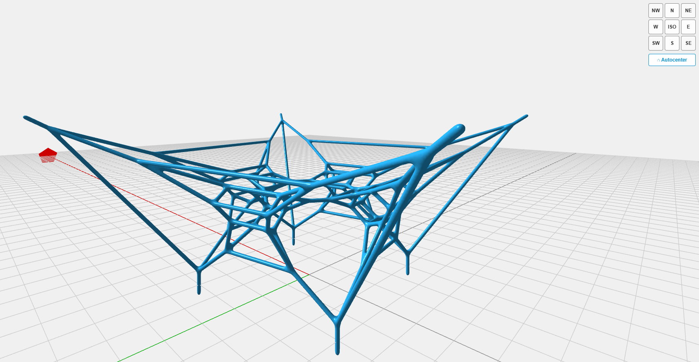

# 3DviewerStructApp_AS

**Author:** Abhishek Shinde  

**Date Created:** 10-04-2025

**License:** Apache License  

**Copyright:** exDAS | Robert McNeel & Associates  

---

## Netlify Hosted Link
[Visit the Application](https://graphicstatics-viewer-daslabs.netlify.app/)

---

## **Preview**



---

## **About**

A static vanilla JS obj viewer based on rhino3dm.js and three.js. Documentation of conversion of rhino3dm.js geometry with three.js is as below: 

https://threejs.org/docs/#examples/en/loaders/3DMLoader 

rhino3dm.js is a javascript library with an associated rhino3dm.wasm (web assembly) that is OpenNURBS plus additional C++ to javascript bindings compiled to web assembly. Web assembly is now an available technology on all major browsers as well as node.js.

The app is work in progress 


This is based on https://mcneel.github.io/rhino3dm/javascript/api/index.html 

---

## **Computational Design Methods — Camera ↔ Object Relationship**

The viewer enforces a **true two-point perspective** (vertical world lines stay strictly vertical on screen) while keeping the loaded geometry centered on the page with equal vertical margin above and below. Three things make that work together:

### 1. Sheared projection matrix (instead of tilting the camera)

In a normal 3D viewer you *rotate* the camera to look down at the model. That introduces a third vanishing point along the vertical axis — vertical edges converge toward the top or bottom of the screen. To prevent this, the camera is kept strictly horizontal and the projection matrix is sheared instead.

```
World setup (Z-up, camera looking along +Y horizontally):

       z ↑
         │      ╱── model
   cam ──┼───╱──────── target
         │ ╱
         ╰────────────────→ y
                horizDistance
```

The camera sits at `(0, −distance, targetZ + heightOffset)` and is forced to `lookAt(0, 0, targetZ + heightOffset)` — i.e. its image plane is parallel to the world Z axis. To bring the target (which is *below* the camera in world space) back to screen center, the **vertical principal point** of the projection is shifted:

```
elements[9] = −heightOffset / (horizDistance · tan(fovV / 2))
```

Derivation (camera-space target at `cy = −heightOffset`, `cz = −horizDistance`):

```
y_ndc = −cy · elements[5] / cz − elements[9]
      = −(−heightOffset) · (1/tan(fovV/2)) / (−horizDistance) − elements[9]
      = −heightOffset / (horizDistance · tan(fovV/2)) − elements[9]

setting elements[9] = −S where S = heightOffset / (horizDistance · tan(fovV/2))
→ y_ndc(target) = 0
```

The sign matters: an earlier version used `+S` and the target landed at `y_ndc = −2S`, pushing the model to the bottom of the screen.

### 2. Vertex-averaged centroid (not bbox center)

A bounding-box midpoint is biased by thin members extending past the visible mass — a single tall strut pulls `box.center.z` upward and the model ends up bottom-heavy on screen. We walk every mesh vertex once instead:

```
centroid    = (1/N) · Σ vᵢ              // visual mass center
radialExtent = max(√(vᵢ.x² + vᵢ.y²))    // worst-case sweep around Z axis
halfHeight   = max(|vᵢ.z − centroid.z|) // symmetric around centroid
```

`radialExtent` is *worst case* — i.e. how far the model reaches from the Z rotation axis at any turntable angle — so we never clip during the spin.

### 3. Auto-framing with equal top/bottom margin

Camera distance is the larger of the two FOV constraints, with a 20 % padding factor:

```
fovH    = 2 · atan(tan(fovV/2) · aspectRatio)
dᵥ      = halfHeight   / tan(fovV / 2)         // vertical fit
d_h     = radialExtent / tan(fovH / 2)         // horizontal fit
distance = max(dᵥ, d_h) · 1.2
```

Camera height is derived from `distance` so the resulting two-point shear stays in a sane range (a cap of `MAX_SHEAR = 0.4` keeps the principal-point shift well inside the viewport):

```
heightOffset = distance · MAX_SHEAR · tan(fovV / 2)
```

Because the target is set to `centroid.z` and `halfHeight` measures from there symmetrically, the top and bottom of the model project to:

```
y_ndc(top)    = +halfHeight / (distance · tan(fovV / 2)) = +1 / 1.2 ≈ +0.83
y_ndc(bottom) = −halfHeight / (distance · tan(fovV / 2)) = −1 / 1.2 ≈ −0.83
```

Equal magnitudes → equal vertical margin on the page, regardless of model proportions:

```
   ┌──────────────────────┐  ← top of viewport
   │      empty (≈10%)    │
   │ ╔══════════════════╗ │
   │ ║                  ║ │
   │ ║   model fills    ║ │  ← y_ndc = +0.83 .. −0.83
   │ ║   ~80% of height ║ │
   │ ║                  ║ │
   │ ╚══════════════════╝ │
   │      empty (≈10%)    │
   └──────────────────────┘  ← bottom of viewport
```

### 4. View cube + Autocenter

The 3×3 view cube (N, S, E, W, the four diagonals, ISO) reuses the same `distance` and `heightOffset` so every preset has identical two-point shear — only the azimuth changes. **Autocenter** simply re-runs the fit routine, useful after panning or zooming. Both also run automatically on window resize, so the centered framing survives any layout change.

---

### **Features**

Ability to visualize Iso-curves, Mesh-Edges, Point Clouds, SubD similar to rhino example on three. js example 

The project has several versions for script.js just so that the user can learn three.js workflows. 

This project does not currently use React and Node.js 

---

## **Usage(Local Deployment)**

1. Clone the repository to your local machine.
2. Open a terminal and navigate to the repository's directory.
3. Run the following command on the command terminal just opened: python -m http.server 
4. Open your browser and navigate to:  
   [http://localhost:8000/index.html](http://localhost:8000/index.html)


---

## **Project Status**

This project is optimized for desktop use and is currently under development for mobile compatibility.

---

## **License**

This project is licensed under the Apache License. See the LICENSE file for more details.

---


